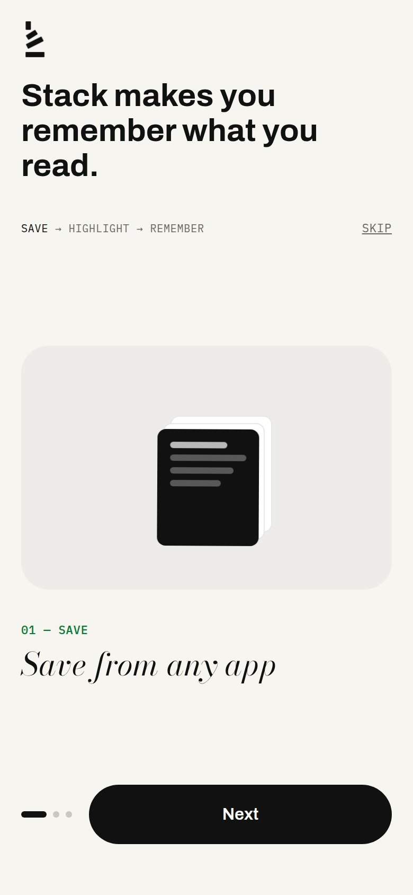
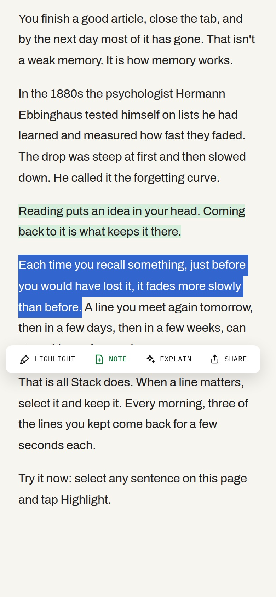
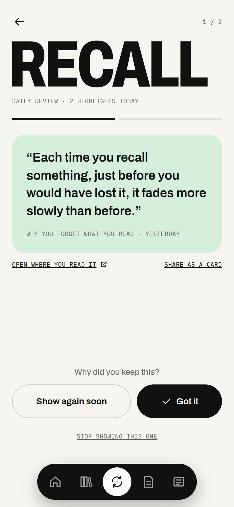

<p align="center">
  
</p>

<h1 align="center">Stack</h1>

<p align="center">
  <b>Stack makes you remember what you read.</b><br>
  Save → Highlight → Remember. An open-source reading app for Android and the web.
</p>

<p align="center">
  
  
  
</p>

<p align="center">
  <a href="docs/assets/stack-demo.mp4"><b>Watch the 36-second demo</b></a>
</p>

Most of what we read is forgotten within a week. **Stack** is built around one loop:

1. **Save** articles, PDFs and books from any app with the share sheet.
2. **Highlight** a line, and it becomes a note that remembers where it came from.
3. **Remember:** every morning, three of your past highlights come back on a spaced schedule.

Stack is free, has no ads, works fully offline without an account, and is open source.
It's built by StackForge Labs.

## Features

| | |
|---|---|
| **Highlights & notes** | Select text: Highlight, + Note or Share. A Keep-style editor with titles, checklists, colours, **fonts** (five built in, or add your own font file), pin, autosave, share, and delete with Undo. **Export to Markdown** (a `.md` file or straight into Obsidian, Notion…), grouped by source with links |
| **Library & PDF reader** | Coloured shelves, pdf.js reader with highlights and page notes, reading time left, every PDF on the phone (Android). **Listen mode** reads articles and PDFs aloud (text-to-speech through the music player). **Import from Telegram**: connect your own bot, forward PDFs, pick which to add |
| **Share to Stack** | Share from Chrome, WhatsApp, YouTube or Files: a small "Saved to Stack" card pops up over the app you're in. Links go to the Library, PDFs to a shelf, text to notes |
| **Daily review** | 3 old highlights a day on a spaced schedule (Got it / Show again soon / Stop), also in the morning notification |
| **Focus session** | Pick a PDF or article, 15–60 min timer or **Pomodoro** (4 × 25 min with 5-minute breaks and a 15-minute long break), music, quick notes, then a summary (pages, highlights, notes) with a streak |
| **Today** | Top story, swipeable rows of more stories, PDFs you're reading and recent notes, a focus card, the daily review and a **This week** card (time read, articles finished, PDF pages) |
| **News** | **My feeds** (any RSS/Atom feed, or just a site like `css-tricks.com`) plus 12 topics (Top, Video, India, World, Tech, AI, Dev, Business, Science, Sports, Entertainment, Health) from BBC, The Hindu, Times of India, Indian Express, Al Jazeera, Mint, The Guardian, Hacker News and dev.to. **Video** plays news channels' latest reports (BBC, Al Jazeera, DW, Reuters, WION, NDTV, India Today) in YouTube's privacy-enhanced player. Flash cards or a list with the date and time on every story, pull to refresh (the Stack logo stacks itself while it loads), a clean reader mode, **offline reading** (download or save; top stories cached in the background) and **breaking-news alerts** per topic (Android, at most one an hour) |
| **Music** | Songs on the phone on a spinning record with the title on its label: background play, Stack-styled notification and lock screen, shuffle, repeat, speed, sleep timer, ±10 s, Up next queue, Play next / Add to queue; your own playlists with cover images, or Spotify |
| **Search** | One search across notes, checklists, highlights, saved articles, PDFs and playlists, with filters and recent searches |
| **Profile** | Photo, bio, status, profile colour, interests (News shows them first) and a daily focus goal. Reader type, streaks, an activity heatmap and 12 badges |
| **Stack AI** (optional) | Summarize an article, ask questions about a PDF (answers link to pages), "Ask your Stack" across your own notes, and tidy a note. Runs on OpenAI or Claude through Stack's server; asks before sending anything, and one switch in Settings turns it off |
| **Account & sync** | Continue with Google (or email). Notes, saved articles, PDFs, playlists, focus history and profile sync across devices (Supabase). Works fully offline without an account |
| **Backup & restore** | Everything in one file (with or without the PDF files), no account needed |
| **Everything else** | Light/dark theme, tablet layout, animated splash, daily digest notification, 148-icon set (`src/components/icons.tsx` + `stack-icons.tsx`) |

**Coming in the next update:** EPUB books, the whole app in Hindi, "Explain this" on selected text,
a home-screen widget, word meanings and translation, and a new first-run tour with a sample article.

## Run it

```bash
git clone https://github.com/chhari07/stackforge.git
cd stackforge
npm install
npm run dev        # http://127.0.0.1:3000
```

News, articles, PDFs, notes, focus and review work with no setup and no keys.
Accounts, Spotify and Stack AI are optional (below).

## Android app (APK)

```bash
./build-apk.sh     # → ~/Desktop/Stack.apk
```

It uses a JDK 21 + Android SDK in `~/.local/share/tipsy-toolchain`. The script:

1. builds a static bundle (`STACK_TARGET=apk next build` → `out/`). There's no
   server in the app: it fetches news and pages itself with Capacitor's native
   HTTP, and uses Readability + DOMPurify for reader mode;
2. creates/updates `android/` with Capacitor and applies
   `scripts/android-setup.mjs` (icon, splash, native plugins from
   `native/android/`, share card, permissions);
3. runs Gradle and copies the debug-signed APK to the Desktop.

Install by opening the APK on the phone (allow "Install unknown apps" once), or `adb install -r ~/Desktop/Stack.apk`.

## Accounts and sync (optional, Supabase)

Copy `.env.example` to `.env.local` and follow **[supabase/README.md](supabase/README.md)**:
create a Supabase project (the free plan is enough), run
[`supabase/schema.sql`](supabase/schema.sql) in its SQL editor, and turn on
Google and Email sign-in. PDF files sync too (up to 50 MB each).

## Stack AI (optional)

AI runs only in a Supabase Edge Function (`supabase/functions/ai`), so no key
ever goes into the app. It needs a signed-in account (above). Deploy the
function, set its secrets in Supabase, and point the app at it in `.env.local`:

```bash
npx supabase functions deploy ai --no-verify-jwt
npx supabase secrets set AI_PROVIDER=openai OPENAI_API_KEY=sk-...   # or anthropic + ANTHROPIC_API_KEY

NEXT_PUBLIC_AI_URL=https://<project>.supabase.co/functions/v1/ai   # .env.local; empty hides AI
NEXT_PUBLIC_AI_ENGINE=OpenAI                                        # the name shown before anything is sent
```

Models are set per feature (`OPENAI_MODEL`, `AI_MODEL`, …) and each person gets
`AI_DAILY_LIMIT` requests a day (default 50), counted in the database. See
[`.env.example`](.env.example) and the diagram in
[`docs/Stack_AI_Engines.excalidraw`](docs/Stack_AI_Engines.excalidraw).
Never put a key in `.env.example`: it's in git.

## Spotify (optional)

1. Create an app at https://developer.spotify.com/dashboard (Web API + Web Playback SDK).
2. Redirect URIs: `http://127.0.0.1:3000/music/callback` and `com.chhari.stack://callback`.
3. Put the Client ID in `.env.local` (or paste it in the app under Settings), then open **http://127.0.0.1:3000**.

Play/pause/skip needs Spotify Premium; free accounts can browse and "Open in
Spotify". The unfinished in-app Spotify player (`native/wip/`) needs Spotify's
App Remote SDK `.aar` in `native/android-libs/`, which isn't included here:
download it from Spotify's Android SDK releases.

## How it works

- **Next.js 16** (App Router) + Tailwind v4, **Capacitor 8** for Android. Fonts: Archivo, Bodoni Moda, IBM Plex Mono.
- **Local-first:** notes, PDFs, playlists and everything else live in IndexedDB (`idb-keyval`); every write is tracked (`src/lib/sync-state.ts`) so sync can upload it later.
- **Sync** (`src/lib/sync.ts`): one row per item in the Supabase `items` table, numbered by the server on every write; upload changes, then download the rows numbered after the last one this device has. Local edits not yet uploaded win.
- **Your own feeds** are read by the phone; the website reads them through `/api/feed`, which only fetches public addresses (no local or private networks, checked on every redirect).
- **Stack AI** (`supabase/functions/ai`): checks the Supabase sign-in, applies the daily limit, streams the answer, and turns the engine's citations into page and note links.
- **Reader mode:** only story ids are accepted by the website's `/api/article` (no arbitrary URLs); links shared into the Android app are fetched by the phone itself.
- **Highlights** use the CSS Custom Highlight API, so saved quotes are painted back without changing the page.
- **Native Android** (`native/android/`): local music (Media3), PDF discovery, share card (`ShareActivity`), Google account picker (Credential Manager), backup file saving, splash.

## Project layout

```
src/app/          screens (Today, News, Music, Library, Notes, Focus, Review, Share, Account…)
src/components/   UI pieces (cards, players, editor, sign-in…)
src/lib/          storage, sync, news, feeds, search, backup, AI client, music…
native/android/   Java plugins copied into the Android project
supabase/         database script, the Stack AI function and the setup guide
docs/             roadmap, diagrams, banner, screenshots
website/          soft-launch landing page and tester sign-up (its own Next.js project)
```

See [docs/ROADMAP.md](docs/ROADMAP.md) for what's next.
